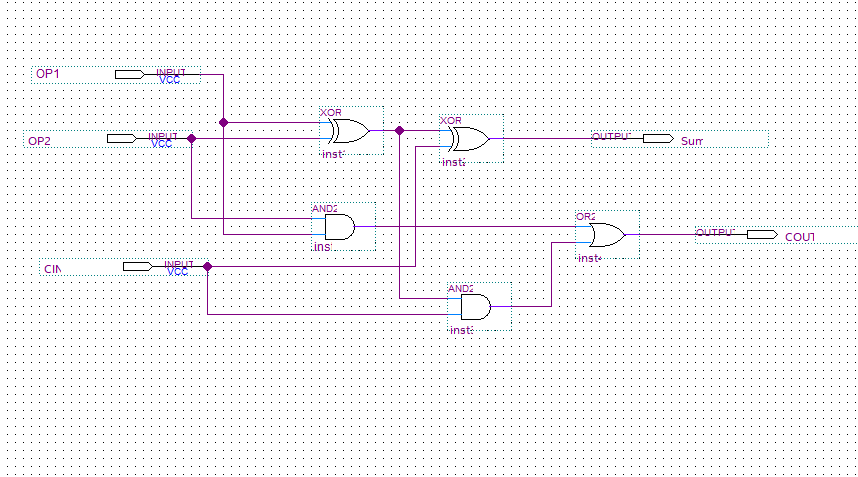
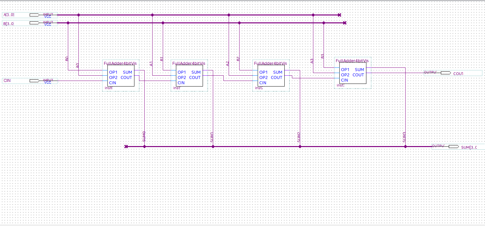
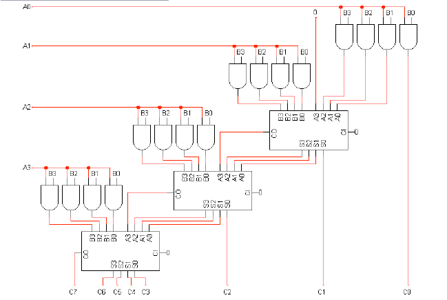

# ALU Project - Phase 1

**Course:** CMP 101 - Logic Design  
**Institution:** Cairo University - Faculty of Engineering - Computer Engineering Department  
**Academic Year:** 1st Year  

---

## Team Members

- Mohamed Osama
- Yousuf Safwat
- Yousef Sayed 
- Yasmine Ismail

---

## What This Project Does

We built a 4-bit Arithmetic Logic Unit (ALU) using Verilog HDL that runs on the DE1-SoC FPGA board. The ALU takes two 4-bit numbers as inputs through switches on the board and performs one of four operations, displaying the result on LEDs.

---

## Operations

The ALU can do four things:

1. **Addition** - Adds two 4-bit numbers and gives a 5-bit result (includes carry bit)
2. **Subtraction** - Subtracts one 4-bit number from another and shows the sign
3. **Multiplication** - Multiplies two 4-bit numbers to get an 8-bit result
4. **Average** - Calculates the average of two numbers

---

## How to Use the Board

### Inputs (Switches)

- **SW[3:0]** - First number (A)
- **SW[7:4]** - Second number (B)
- **SW[9:8]** - Operation selector

### Selecting Operations

- **SW[9:8] = 00** - Addition
- **SW[9:8] = 01** - Subtraction
- **SW[9:8] = 10** - Multiplication
- **SW[9:8] = 11** - Average

### Output (LEDs)

- **LEDR[7:0]** - Shows the 8-bit result

The way results are displayed depends on the operation:
- **Addition:** Upper 3 bits are zero, 5th bit shows carry-out, lower 4 bits show the sum
- **Subtraction:** 8th bit shows the sign (1 for negative), lower 4 bits show the magnitude
- **Multiplication:** All 8 bits are used for the product
- **Average:** 8th bit is a "half bit", lower 4 bits show the average

---

## How We Built It

### Module Structure

We organized the code into several modules that build on each other:

**ALU_Top** - Top level module that connects to the FPGA switches and LEDs

**ALU_Core** - Main logic that selects which operation to perform

**Add1bit** - A single 1-bit full adder (the basic building block)

**Add4bit** - A 4-bit adder made from four 1-bit adders chained together

**Sub4bit** - Handles subtraction using 2's complement method

**Mul4bit** - Multiplies numbers using partial products

**Average4bit** - Adds two numbers and divides by 2

---

## Technical Details

### 1-bit Full Adder

This is the foundation for everything. It takes three inputs (two bits plus a carry-in) and produces a sum and carry-out. We used the standard logic equations:

- Sum = A XOR B XOR Carry_in
- Carry_out = (A AND B) OR (A AND Carry_in) OR (B AND Carry_in)

*Figure 1: 1-bit full adder schematic showing XOR and AND gates*

### 4-bit Ripple Carry Adder

We connected four 1-bit adders in a chain where the carry-out of each adder feeds into the carry-in of the next one. This is called a ripple carry adder because the carry "ripples" through from right to left.

*Figure 2: 4-bit ripple carry adder showing the chain of four 1-bit full adders with carry propagation*

For example: 10 + 6 = 16
- A = 1010, B = 0110
- Result = 10000 (the fifth bit is the final carry-out)

**Test Cases:**
- 5 + 3 = 8 (expected: 00001000)
- 15 + 1 = 16 with carry (expected: 00010000)
- 15 + 15 = 30 (expected: 00011110)

---

### 4-bit Subtractor

We implemented subtraction using the 2's complement method. The module computes A - B by taking the 2's complement of B (flip all bits and add 1) and adding it to A.

The key challenge is handling negative results. When A < B, the result is negative and comes out in 2's complement form. We detect this by checking the carry-out bit - no carry means the result is negative. For negative results, we convert back to magnitude form by taking the 2's complement again and setting a sign bit.

*Figure 3: Subtractor block diagram showing 2's complement logic and conditional complement*

**Example:** 3 - 9 = -6 gives output 00010110 (bit 4 is the sign bit, lower 4 bits show magnitude 6)

**Test Cases:**
- 9 - 3 = 6 positive result (expected: 00000110)
- 3 - 9 = -6 negative result, sign bit = 1 (expected: 00010110)
- 5 - 5 = 0 (expected: 00000000)

---

### 4-bit Multiplier

We built an array multiplier that generates partial products and adds them together. For each bit in B, we AND it with all bits of A to create a partial product. Each partial product is shifted left by one position relative to the previous one.

We use 16 AND gates (4×4 grid) to generate all partial products simultaneously, then three 4-bit adders to sum them progressively. The output is 8 bits since 4-bit × 4-bit can produce up to 8 bits (max: 15 × 15 = 225).

*Figure 4: 4×4 array multiplier showing AND gate array and cascade of adders*

**Example:** 5 × 3 = 15
- Generates partial products based on bits of B
- Adds them with proper alignment to get 00001111

**Test Cases:**
- 5 × 3 = 15 (expected: 00001111)
- 15 × 15 = 225 maximum product (expected: 11100001)
- 0 × 15 = 0 (expected: 00000000)

---

### Average Calculator

This module computes the floor of (A + B) / 2. We use a 4-bit adder to get a 5-bit sum (4 bits + carry), then divide by 2 using a right shift operation.

In binary, dividing by 2 is just a right shift - we take bits [4:1] of the 5-bit sum and output them as the 4-bit average. The least significant bit is discarded, which gives us the floor function automatically.

*Figure 5: Average module showing adder output concatenation and right shift*

**Example:** (10 + 6) / 2 = 8
- Sum = 10000 (binary 16)
- Right shift gives 1000 (binary 8)

**Test Cases:**
- (10 + 6) / 2 = 8 (expected: 00001000)
- (15 + 15) / 2 = 15 (expected: 00001111)
- (1 + 0) / 2 = 0 (expected: 10000000)   //the 8th bit indicates the half

---

## What We Learned

Building this ALU helped us understand several important concepts:

- How basic digital circuits like full adders work
- How to write hardware descriptions in Verilog
- How to use FPGA development tools (Quartus)
- How complex circuits are built from simple components
- The FPGA design flow from code to actual hardware

The most challenging part was probably the subtractor because we had to properly handle negative numbers and make sure the sign bit was correct. The multiplier was also complex because of all the partial products that need to be generated and added.

---

## References

1. Intel DE1-SoC User Manual
2. Verilog HDL Reference Manual
3. Nandland website for Verilog tutorials

---

**Version:** 1.0

## Upcoming (Phase 2)
